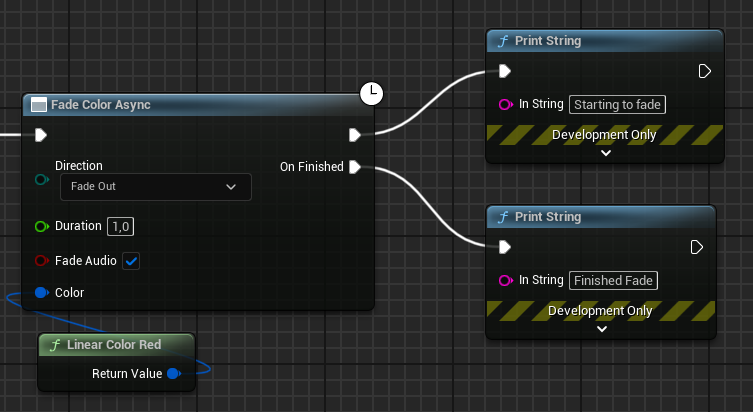

# Simple Async Fades Documentation

This page contains user documentation for the (Simple Async Fades)(TODO:Link) plugin.

This plugin adds 6 asynchronous blueprint nodes into UE5. These nodes can be used to easily fade the screen, without having to keep track of fading logic yourself. The nodes have several output pins that fire at the end of a fading operation, or during a dip (also known as fade out, do something, fade in). The simplest nodes make some assumptions about the game, in order to cover most cases with the littlest configuration. For more advanced cases, like local splitscreen multiplayer or games involving Time Dilation, check the Advanced Nodes.

### Fade

> **Fade Async**
> 
>
> The simplest fade node available. Will cover most cases by fading to black over the specified duration.

> **Fade Color Async**
> 
> 
> A simple fade node that allows customizing the fade color and duration, while remaing lightweight and straightforward.

> **Advanced Fade**
> 
> 
> An advanced fade node that is highly customizable. Useful in more niche situations when the simple fade nodes don't suffice. For example when Time Dilation or local splitscreen is involved.
> 
> **Image legend:**
>
> | # | Explanation                                                                                                                                                                                                                                         |
> |---|-----------------------------------------------------------------------------------------------------------------------------------------------------------------------------------------------------------------------------------------------------|
> | 1 | Input a user specified color to fade to                                                                                                                                                                                                             |
> | 2 | Option to select which player controllers should fade, this allows fine control in split-screen multiplayer                                                                                                                                         |
> | 3 | Options available to fade the first, the specified, or all player controllers                                                                                                                                                                       |
> | 4 | Specify a Fade Curve to use instead of fading linearly from 0 to 1                                                                                                                                                                                  |
> | 5 | Example fade curve. In the time between 0 and 1, the value must go from 0 to 1. When Duration is bigger, for example 5 seconds, the Fade Curve must still be between 0 and 1. The underlying system scales this value to the duration automatically |

### Dip

> **Dip Async**
> 
> A simple Dip node that fades the screen to black, lets the user perform an action, and fades back to the game view. The fade durations as well as the dip duration (the time the screen stays fully black) can be customized.

> **Dip Color Async**
> 
> A simple Dip node that acts the same as the Dip node, except it allows customization of the color.

> **Advanced Dip**
> 
> An advanced dip that has many of the same advanced features of the Advanced Fade Node. 

### Feature comparison

| **Node/Features**       | **Behaviour**                                               | **Color**      | **Tick while paused** | **Split-screen supported** | **Affected by Time Dilation** | **Tick in Editor** | **Fade Curve**            |
|-------------------------|-------------------------------------------------------------|----------------|-----------------------|----------------------------|-------------------------------|--------------------|---------------------------|
| **Fade Async**          | Fade between Game and Black                                 | Black          | No                    | No                         | Yes                           | No                 | Linear                    |
| **Fade Color Async**    | Fade between Game and Color                                 | User specified | No                    | No                         | Yes                           | No                 | Linear                    |
| **Advanced Fade Async** | Fade between Game and Color, very customizable.             | User specified | Optional              | Yes                        | Optional                      | Optional           | Linear (user overridable) |
| **Dip Async**           | Fade from Game to Black, perform action, fade back to Game. | Black          | No                    | No                         | Yes                           | No                 | Linear                    |
| **Dip Color Async**     | Fade from Game to Color, perform action, fade back to Game. | User specified | No                    | No                         | Yes                           | No                 | Linear                    |

### Usage notes

1. Results can be unexpected when multiple fades overlap, or when other systems (such as the Unreal Engine Level Sequencer) are also executing fades. It is up to the game logic to ensure that these nodes don't interfere with each other and only one fade or dip is happening at once.
2. Fades are not replicated and have to be called locally on each client in order to work with networked multiplayer.
